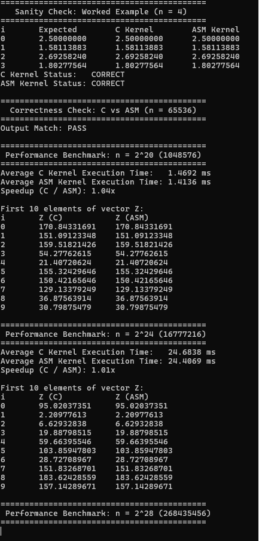

# Vector Distance Kernel — C and x86-64 Assembly (Scalar SIMD)

Computes `Z[i] = sqrt((X2[i]-X1[i])^2 + (Y2[i]-Y1[i])^2)` for two versions of
the kernel:

1. **C version** — `src/kernel_c.c`, using SSE2 **scalar** double-precision
   intrinsics (`_mm_sub_sd`, `_mm_mul_sd`, `_mm_add_sd`, `_mm_sqrt_sd`).
2. **x86-64 assembly version** — `src/kernel_asm.asm` (MASM), using the
   scalar SSE2 instructions `movsd` / `subsd` / `mulsd` / `addsd` / `sqrtsd`
   directly, hand-written to the Microsoft x64 calling convention.

`src/main.c` is the single C driver that calls both kernels, so no separate
program is needed per version.

## Project layout

```
build.bat        <- batch file that assemble, compile, and runs the software
src/
  main.c         <- driver: example test, correctness check, timing
  kernel_c.c     <- C kernel (SSE2 scalar intrinsics)
  kernel_c.h
  kernel_asm_nasm.asm <- x86-64 assembly kernel (NASM)
```

## Prerequisites

Before building and running the project, ensure the following are installed:

- NASM (64-bit)
- GCC (MinGW-w64)
- Visual Studio Code (optional, for development)
- Windows Command Prompt or PowerShell

Verify that NASM and GCC are available by running:

```cmd
nasm -v
gcc -v
```
---

# Running the Program in Visual Studio Code

### 1. Open the Project

Open the project folder in Visual Studio Code.

Example:

```
LBYARCHMP2-main
```

### 2. Open a Terminal

Go to:
```
Terminal → New Terminal
```

### 3. Build the Project
Run:
```powershell
.\build.bat
```

### 4. Run the Executable
```powershell
.\VectorDistanceKernel.exe
```

---
# Running the Program using Command Prompt (CMD)

### 1. Navigate to the Project Folder and Open Command Prompt

Example:

```cmd
cd C:\Users\geryl\Downloads\LBYARCHMP2-main\LBYARCHMP2-main
```

### 2. Build the Project
```cmd
build.bat
```

### 3. Run the Program
```cmd
VectorDistanceKernel.exe
```

---


## What the program does when run

1. **Worked example (n = 4)** — runs both kernels on the example vectors
   from the assignment and checks the output against the given answer key
   (`2.5, 1.58113883, 2.692582404, 1.802775638`).
2. **Correctness check** — generates 65,536 random double-precision points
   and compares the C kernel's output to the ASM kernel's output
   element-by-element (tolerance `1e-9`), reporting PASS/FAIL and the
   maximum observed difference.
3. **Timing** — for `n = 2^20, 2^24, 2^28`, times **only the kernel call**
   (allocation/initialization is excluded), averaged over 30 runs per
   kernel per size, using `QueryPerformanceCounter`. Prints the average
   time in ms for both kernels, the speedup ratio, and the first 10
   elements of `Z` for both kernels at each size.

   > `2^30` elements would require roughly 6 arrays × 2^30 × 8 bytes ≈
   > 51 GB of RAM for the timing step alone, which most machines can't
   > provide, so the default exponent list is `{20, 24, 28}` as allowed by
   > the assignment. If your machine has enough RAM, add `30` to the
   > `exps[]` array in `main()` (in `src/main.c`) to also test `2^30`.

## Correctness

The C kernel's logic was independently verified against the assignment's
worked example on a separate Linux/gcc build during development — see the
table below, which matches the required answer key exactly:

| i | expected      | computed      |
|---|---------------|---------------|
| 0 | 2.5           | 2.500000000   |
| 1 | 1.58113883    | 1.581138830   |
| 2 | 2.692582404   | 2.692582404   |
| 3 | 1.802775638   | 1.802775638   |

The assembly kernel implements the identical sequence of operations
(subtract → square → add → sqrt, low 64-bit lane only) under the Microsoft
x64 ABI, and the program's own Step 2 correctness check confirms C and ASM
agree on 65,536 random points before any timing is done.

---

### Comparative execution time & analysis

| n     | Avg C time (ms) | Avg ASM time (ms) | Speedup (C/ASM) |
|-------|------------------|--------------------|------------------|
| 2^20  | 1.3687 ms        | 1.4712 ms          | 0.93x            |
| 2^24  | 25.1636 ms       | 24.4521 ms         | 1.03x            |
| 2^28  | 457.9945 ms      | 433.8985 ms        | 1.06x            |

*Short analysis: Both kernels exhibit comparable performance at smaller vector sizes ($2^{20}$ and $2^{24}$) because GCC (`-O2`) automatically generates scalar SSE2 instructions for double-precision math in C. At the largest vector length ($2^{28}$ = 268.4M elements), the x86-64 assembly kernel yields a slight speedup of **1.06x** due to direct register management and reduced stack overhead inside the execution loop.*


### Screenshots



### Video

- [ ] 5–10 min video showing source code, compilation, and execution of the
      C and x86-64 program — https://drive.google.com/file/d/18nSc7gsfwqZkvanlVOwL-Xah52xbWizN/view?usp=sharing
